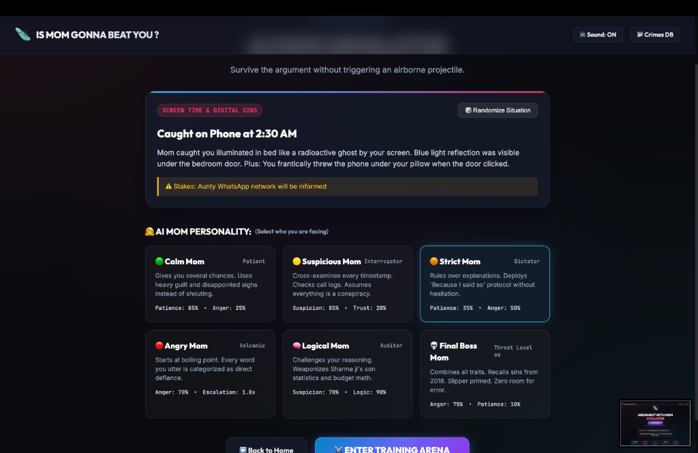
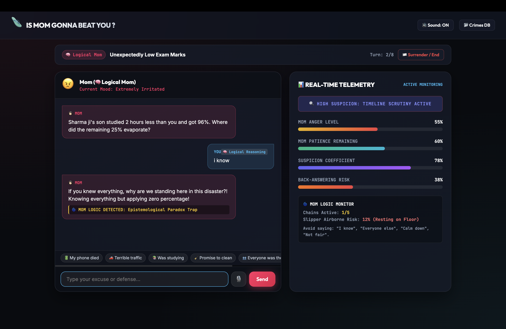
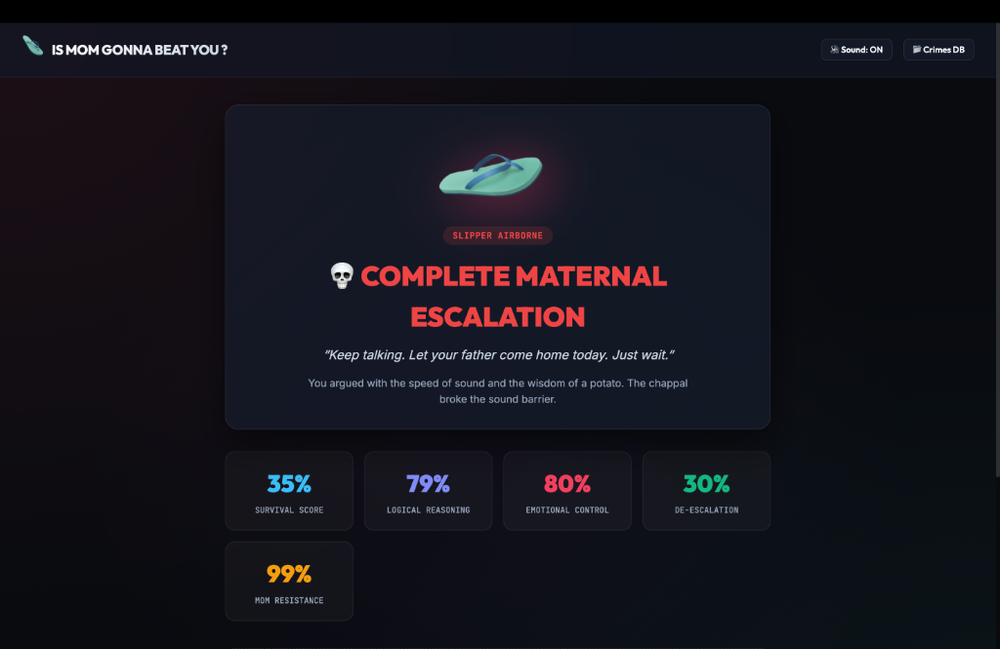
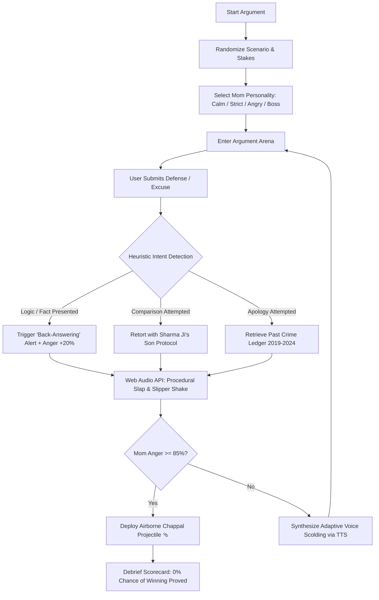

# Is Mom Gonna Beat You? - Argument With Mom Simulator 🩴🎯

## Basic Details
### Team Name: Fuego Lento

### Team Members
- Team Lead: Akhilesh R - MACE
- Member 2: Aswin Suresh - MACE


### Project Description

Argument with Mom Simulator is an AI-powered simulator where an LLM generates random, realistic everyday situations and becomes an unpredictable AI Mom for the user to handle.
The system analyzes the user's responses using speech recognition, NLP, sentiment, anger, confidence, escalation, and argument patterns while the AI Mom dynamically adapts to the conversation.
It turns completely unnecessary arguments into an interactive training experience, helping users practice handling similar situations before facing them in real life.

### The Problem (that doesn't exist)

Nobody is properly prepared for the highly unpredictable arguments that may occur with their mom.
There is no scientifically engineered platform for practicing situations like coming home late, asking for permission, defending bad decisions, or explaining suspicious behavior.
Humanity somehow survived without one, but we decided this was an unacceptable gap in technology.

### The Solution (that nobody asked for)

An AI-powered Mom Argument Simulator that generates random real-world situations and forces users to navigate them through natural conversation with an AI Mom.
The AI tracks hidden variables such as anger, patience, suspicion, trust, back-answering risk, and escalation, while dynamically adapting its responses based on what the user says.
After every argument, the system provides an unnecessarily detailed Argument Report, identifies the user's strengths and weaknesses, and uses them to generate increasingly difficult situations for future training.

---

## Technical Details
### Technologies/Components Used
For Software:
- **Languages**: HTML5, CSS3, Vanilla JavaScript (ES6+)
- **Audio & Speech**: Web Audio API (real-time frequency analyzer, procedural sound synthesis for chappal slaps), Web Speech Synthesis API (emotion & pitch-modulated Indian English maternal voice), Web Speech Recognition API
- **UI & Graphics**: Custom Glassmorphism design system, CSS keyframe animation engine (`flyChappal`, `shake`, `pulse`), CSS Custom Properties design tokens
- **Tools**: Python 3 (HTTP dev server), Git & GitHub, Brave Browser

---

## Implementation
For Software:

### Installation
```bash
git clone https://github.com/akhilesh2007-r/useless_project_temp.git
cd useless_project_temp
```

### Run
```bash
# Start local development server
python3 -m http.server 3000

# Open http://localhost:3000 in your browser (Brave / Chrome / Edge)
```

---

## Project Documentation
For Software:

### Screenshots

#### 1. Landing Page & Historical Statistics Dashboard

*The central command deck displaying historical maternal argument statistics (100% Moms Declared Winner, 0 Logic Attacks Succeeded) and the primary 'Start Argument' trigger.*

#### 2. Dynamic Scenario Generator & Personality Matrix

*Randomized real-world crisis generator (e.g., 'Caught on Phone at 2:30 AM') with customizable maternal archetypes ranging from 'Suspicious Mom' to 'Final Boss Mom Level 99'.*

#### 3. Chat section

*Dispute categorization engine sorting everyday arguments into Curfew, Screentime, Room Cleanliness, and Academic Grievances.*

#### 4. Post-Argument Debrief & Survival Verdict

*The post-mortem scorecard evaluating survival percentage, logical reasoning, emotional control, and the inevitable 'Complete Maternal Escalation' flying chappal strike.*

---

### Diagrams

#### Conversational State & Escalation Architecture

*Flowchart demonstrating user input processing, back-answering classification, procedural sound triggering, and maternal escalation.*

---

## Team Contributions
- **Akhilesh R**: Front-end architecture, Web Audio API procedural sound synthesis, state machine controller, front page redesign, and speech recognition integration.
- **Aswin Suresh**: Scenario generation engine, maternal personality modeling, historical crimes ledger database, and scoring matrix debrief design.

---
Made with ❤️ at TinkerHub Useless Projects 


