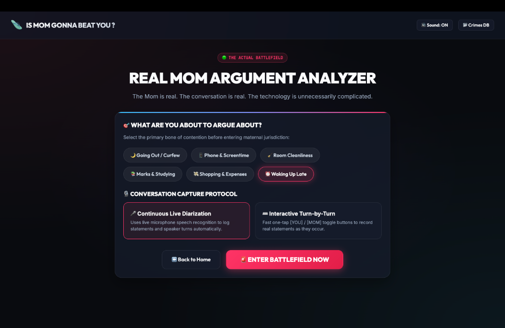
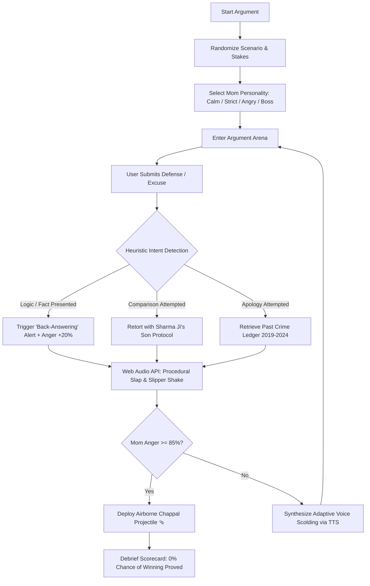

# Is Mom Gonna Beat You? - Argument With Mom Simulator 🩴🎯

## Basic Details
### Team Name: Fuego Lento

### Team Members
- Team Lead: Akhilesh R - MACE
- Member 2: Aswin Suresh - MACE

### Project Description
An absurd, over-engineered conversational battle simulator that scientifically proves you have a 0% statistical probability of winning an argument with an Indian mother. Features dynamic everyday household crises, real-time maternal anger tracking, a flying chappal ballistic threat meter, and an inescapable guilt matrix.

### The Problem (that doesn't exist)
For generations, children have foolishly believed that presenting "rational logic", "factual evidence", and "calm counterarguments" during household disputes would help their case. In reality, presenting logic to an Indian mother is universally classified under maternal jurisprudence as **Aggravated Back-Answering** (+25% Chappal Airborne Risk). The world lacked a rigorous simulator to model this inevitable defeat before real-world damage occurs.

### The Solution (that nobody asked for)
A full-fledged simulation arena where users face off against an AI Mom equipped with six distinct archetypes (Calm, Suspicious, Strict, Angry, Logical, and Final Boss). Mom dynamically retorts with classic Indian household ultimata ("Because I said so!", Sharma ji's son comparisons, 2022 dal-spilling incidents) while modulating voice pitch, anger meters, and calculating your final Survival Score.

---

## Technical Details
### Technologies/Components Used
For Software:
- **Languages**: HTML5, CSS3, Vanilla JavaScript (ES6+)
- **Audio & Speech**: Web Audio API (real-time frequency analyzer, procedural sound synthesis for chappal slaps), Web Speech Synthesis API (emotion & pitch-modulated Indian English maternal voice), Web Speech Recognition API
- **UI & Graphics**: Custom Glassmorphism design system, CSS keyframe animation engine (`flyChappal`, `shake`, `pulse`), CSS Custom Properties design tokens
- **Tools**: Python 3 (HTTP dev server), Git & GitHub, Brave Browser

---

## Implementation
For Software:

### Installation
```bash
git clone https://github.com/akhilesh2007-r/useless_project_temp.git
cd useless_project_temp
```

### Run
```bash
# Start local development server
python3 -m http.server 3000

# Open http://localhost:3000 in your browser (Brave / Chrome / Edge)
```

---

## Project Documentation
For Software:

### Screenshots

#### 1. Landing Page & Historical Statistics Dashboard

*The central command deck displaying historical maternal argument statistics (100% Moms Declared Winner, 0 Logic Attacks Succeeded) and the primary 'Start Argument' trigger.*

#### 2. Dynamic Scenario Generator & Personality Matrix

*Randomized real-world crisis generator (e.g., 'Caught on Phone at 2:30 AM') with customizable maternal archetypes ranging from 'Suspicious Mom' to 'Final Boss Mom Level 99'.*

#### 3. Post-Argument Debrief & Survival Verdict

*The post-mortem scorecard evaluating survival percentage, logical reasoning, emotional control, and the inevitable 'Complete Maternal Escalation' flying chappal strike.*

#### 4. Bone of Contention & Topic Categorization

*Dispute categorization engine sorting everyday arguments into Curfew, Screentime, Room Cleanliness, and Academic Grievances.*

---

### Diagrams

#### Conversational State & Escalation Architecture

*Flowchart demonstrating user input processing, back-answering classification, procedural sound triggering, and maternal escalation.*

---

## Project Demo
### Video
- [Demo Video Link Coming Soon]
*Demonstration of scenario selection, speech interactions, anger meter escalation, and debrief verdict.*

### Additional Demos
- Open `http://localhost:3000` locally to experience the interactive chappal physics, audio synthesis, and maternal scolding simulator directly.

---

## Team Contributions
- **Akhilesh R**: Front-end architecture, Web Audio API procedural sound synthesis, state machine controller, front page redesign, and speech recognition integration.
- **Aswin Suresh**: Scenario generation engine, maternal personality modeling, historical crimes ledger database, and scoring matrix debrief design.

---
Made with ❤️ at TinkerHub Useless Projects 


